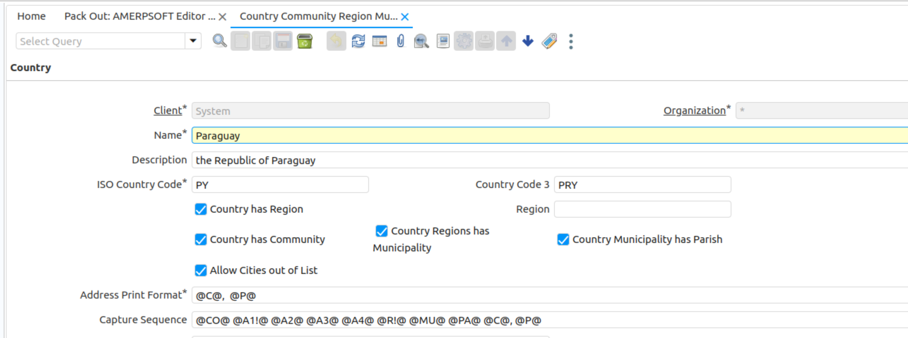
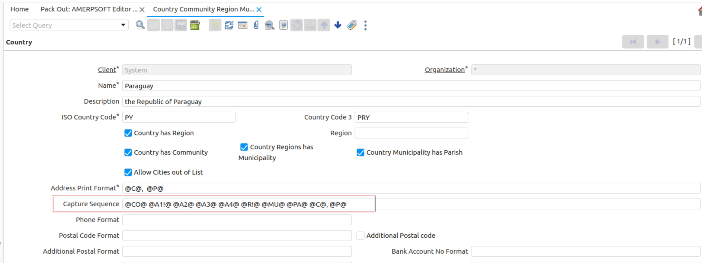

&lArr;[AMERPSOFT Editor](../README.md) | [Home](../README.md)

<!-- PROJECT LOGO -->
<br />
<div align="center">
  <a href="AMERPSOFT_logo">
    
  </a>
</div>

# <b>Amerpsoft editor Version 11 </b>

<a name="readme-top"></a>

<!-- TABLE OF CONTENTS -->

## <b>Installation Steps</b>

Note:
In case you have a previous version installed, verify if tables C_country3 or c_country2 exists in Database. I any of these tables exists, then remove them. 

C_Country3 table, will be created during installation.

Follow steps:

| Steps | Title                                        | Comments                                                                           |
| ----: | ---------------------------------------------- | ---------------------------------------------------------------------------------- |
|     1 | [Install Plugin](#step1)                       | Install Plugin using Apache felix Web Console                                      |
|     2 | [Pack IN CommunityFill Pack](#step2)           | Pack IN CommunityFill Pack                                                         |
|     3 | [Verify ISO3 Country](#step3)                  | Verify country code 3 digits is updated on C_Country table                         |
|     4 | [Import ExtendedDemography](#step4)            | Using SQL Queries, Import ExtendedDemography for your country                      |
|     5 | [Restart Server](#step5)                       | Re-Start iDempiere Server                                                          |
|     6 | [C_BPartner_Location Table](#step6)            | Modify C__BPartner_Location Table                                                  |
|     7 | [Modify Country Record](#step7)                | Modify Country Record for Capture Sequence fields on Locations                     |
|     8 | [World Demography](#step8)                     | Pack-In World demography and Import World Demography                               |
|     9 | [Additional Notes](#step9)                     | Additional notes for installation                                                  |


### <a name="step1"></a>⭐️<b>1-Install Plugin using Apache felix Web Console</b>

```text
- Download plugin jar file from Repository. 
  Named similar to: org.amerpsoft.com.idempiere.editors-com_11.0.0.202404091015.jar
- Install using Osgi Apache Felix Web Console
- or Any Manual procedure
- Verify plugin is running and updated
- Restart idempiere Server, ignore error the first time.
- Verify plugin is Installed and Running
```

Verify Pack-In automatically installed:

```text
- 2Pack_1.0.0.zip
- 2Pack_2.0.0.zip
- 2Pack_3.0.0.zip
- 2Pack_4.0.0.zip
- 2Pack_5.0.0.zip
- 2Pack_6.0.0.zip
- 2Pack_7.0.0.zip
- 2Pack_8.0.0.zip
- 2Pack_8.1.0.zip
- 2Pack_8.2.0.zip
- 2Pack_8.5.0.zip
- 2Pack_8.5.1.zip
- 2Pack_8.5.2.zip
```

** **-Review error starting server-**  **.
- <b>Restart idempiere Server</b>

These Packs IN, creates New structure for Extended Location.
								 
Next, do the following actions:

```text
- Role Access Update
- Syncronize Terminology
- Sequence Check
- <b>Restart idempiere Server</b>
```

<p align="left">(<a href="#readme-top">back to top</a>)</p>

### <a name="step2"></a> ⭐️ <b>2- Pack-IN CommunityFill Pack</b>

 Using AD PackIn
 Download Community File an Pack IN:  
 
```text
- AMERPSOFT Editor - Community Fill.zip
```

<b>Restart idempiere Server</b>


Important to select database version folder for packs (oracle - postgresql).

These Packs-IN creates C_Community default records. 

* For more detail see sql queries in  oracle and postgresql folders, for communities.

One Community for each country in order to be consistent with the model:

```text
- COUNTRY --> COMMUNITY --> REGION --> CITY  
- COUNTRY --> COMMUNITY --> REGION --> MUNICIPALITY --> PARISH
```

<p align="left">(<a href="#readme-top">back to top</a>)</p>

### <a name="step3"></a> ⭐️ <b>3- Verify country code 3 digits is updated </b>

On C_Country table verify:

- CountryCode3 Fields on C_Country Table are already set on Pack-IN Step 2
- For verifying it: 
- Open the new created window:
- <b>System Admin -> General Rules --> System Rules -->Country Community Region Municipality Parish City</b>

<div align="left">
  <a href="ISO_CODE">
    
  </a>
</div>


    
### <a name="step4"></a> ⭐️ <b>4- Import Extended Demography</b>

##### <b>4.1- Import Extended Demography using Packs</b>

Available for PostsgreSQL Only

Before doing this, a Manual Application Dictionary Changes must be done on:
- Table: <b>AD_Package_Exp_Detail</b>
- Column: <b>SQLStatement</b>

Changes:

- Increase <b>Length to 65.000</b>
- Synchronize Column.
- Restart Server

This is necessary only if you are going to use Packs-In., because Demography Packs contain very long queries. Next, proceed with Demography Install.

- Using AD PackIn
- Download Country File:  AMERPSOFT Demografia Venezolana.zip or AMERPSOFT Demografia Paraguay.zip 
- Packin IT.

##### <b>4.2- Import Extended Demography using SQL-Queries</b>

Use DataBase Console.

You may take a look at sql folder:

```text
For Venezuela:
'GeografiaVenezolanaCompleta.sql' 
For Paraguay:
GeografiaParaguayCompleta.sql
GeografiaParaguayExtendida.sql

```

Remember to execute procedures on System Admin --> General Rules: 

    - Role Access Update
    - Sequence Check 
    - Syncronize Terminology
    - Cache Reset

(*) Repeat this procedure for any other Demography queries provided in future.

Delete Queries are available if something goes wrong with Pack-IN. You may delete records for a selected country.
See 'delete_demografia_venezuela.sql' or 'delete_demografia_paraguay.sql'. Delete commands must be executed in the indicated order.

<p align="left">(<a href="#readme-top">back to top</a>)</p>

### <a name="step5"></a> ⭐️ <b>5- Restart Server</b>

- Restart idempiere Server 
- Verify plugin is Installed and Running

<p align="left">(<a href="#readme-top">back to top</a>)</p>

### <a name="step6"></a> ⭐️ <b>6- C_BPartner_Location Table</b>

- Using Application dictionary Modify Table <b>C_BPartner_Location</b>
- Column: <b>C_Location_ID</b>
- Change Reference 
- from: <b>Location</b> 
- to  : <b>LocationExtended</b>

<p align="left">(<a href="#readme-top">back to top</a>)</p>

### <a name="step7"></a> ⭐️ <b>7- Modify Country Record</b>

Using the new window <b>'Country Community Region Municipality Parish'</b> provided.

- Select Country
- Change Capture Sequence field
-    with
- @CO@ @A1!@ @A2@ @A3@ @A4@  @R!@ @MU@ @PA@ @C@, @P@ 

<div align="left">
  <a href="ISO_CODE">
    
  </a>
</div>


<p align="left">(<a href="#readme-top">back to top</a>)</p>

### <a name="step8"></a> ⭐️ <b>8- Pack IN and Import World Demography</b>

World Demography includes 44690 Cities in the world.

They are included without region.

These Cities must be included applying Pack-In and import sql Query provided. 
- Using 'AMERPSOFT World Demography.zip'. Pack-IN City Changes.
- Import Cities using provided Query.

Additional columns were added to c_city Table, such as Name2, Latitude, Longitude, Population.
Use 'Country Region and City' Window and see them on Tab 'City (Without Regions)

(For PostgreSQL)

A sql query is provided 'sql/postgresql/World/mylan_worldcities_alln_202404252250.sql'

(For Oracle)

A sql query is provided 'sql/oracle/World/mylan_worldcities_alln_202405110914.sql'

<p align="left">(<a href="#readme-top">back to top</a>)</p>

### <a name="step9"></a> ⭐️ <b>A- Additional Note</b>

A Pack-Out is provided to execute all changes manually if something goes wrong or you are installing a non fresh database.
Two files are provided in addition:
- AMERPSOFT Editor AD.csv
- AMERPSOFT Editor AD.zip

<p align="left">(<a href="#readme-top">back to top</a>)</p>
