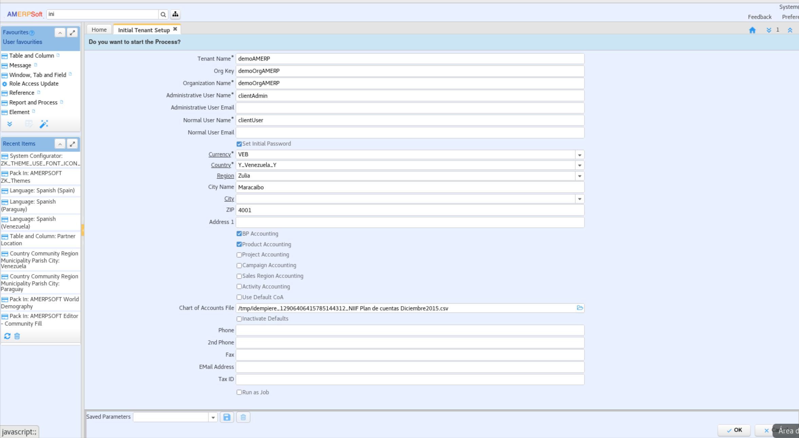
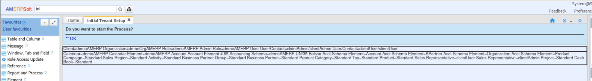
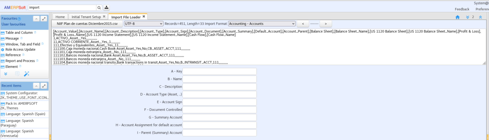
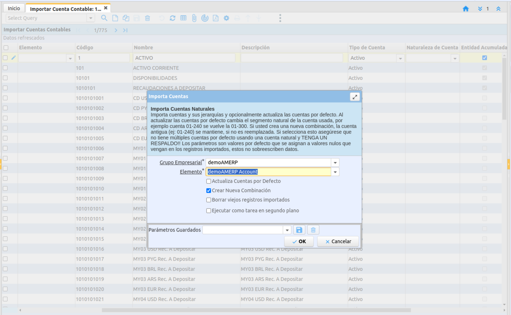
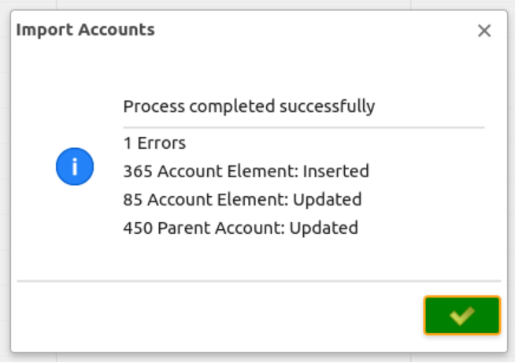
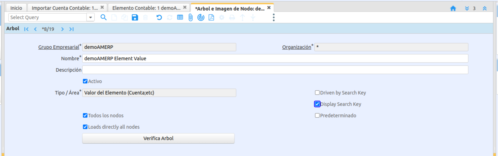
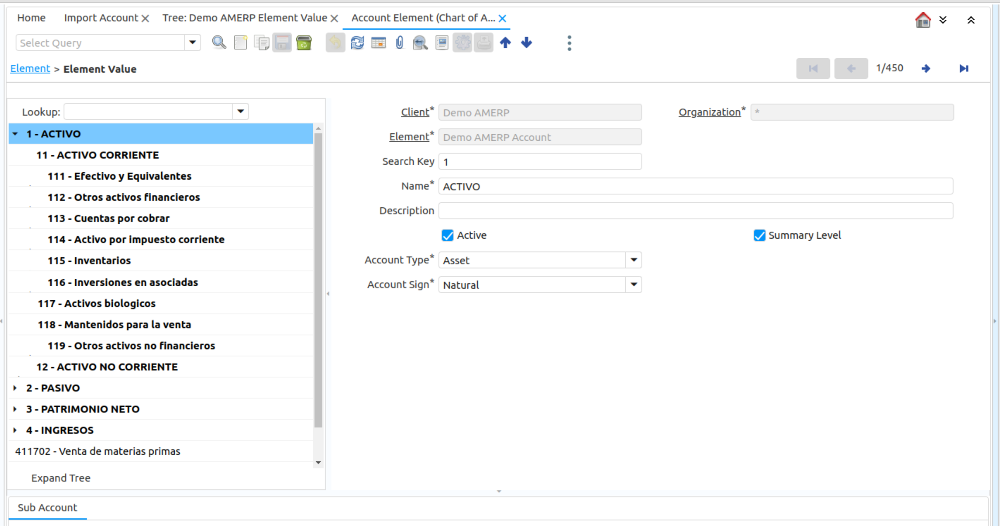

&lArr;[COMMUNITY PLUGINS](../README.md) | [Home](../README.md)
<!-- PROJECT LOGO -->
<br />
<div align="center">
  <a href="AMERPSOFT_logo">
    
  </a>
</div>

<a name="readme-top"></a>

# Financial Plugin

## <b>Description</b>

AMERPSOFT Financial Plugin is related to Idempiere Accounting. This plugin includes some new tasks, processes and reports.

The accounting system is the basis for the beginning of a Client and organizations, it is the first step to begin. An explanation of creating a demo client is included.

<b>Content:</b>

```text
- Database Functions
- Initial Client Setup
- Installing plugin
- Processes
- Accounting Reports
```
Follow steps:

| Steps | Title                                          | Comments                                                                           |
| ----: | ---------------------------------------------- | ---------------------------------------------------------------------------------- |
|     1 | [Install Database Functions](#step1)           | Install Database Functions for Postgresql or Oracle                                |
|     2 | [Initial Client Setup](#step2)                 | Initial Client Setup accounting elements and basic data for a demo Client          |
|     3 | [Installing plugin](#step3)                    | Install plugin using OSGI console                                                  |
|     4 | [Processes](#step4)                            | Verify processes installed                                                         |
|     5 | [Accounting Reports](#step5)                   | Review Accounting Reports                                                          |
|     6 | [Import Financial Taxes](#step6)               | Import Tac categories and taxes                                                    |

## <a name="step1"></a>⭐️1.	Install Database Functions.
#### Special Function for Reporting Dates and Text:

```text
* amf_dow2letter.sql
* amf_month2letter.sql
* amf_num2letter.sql
* amf_num2letter1000.sql
```
Using SQL console, execute these scripts. For Oracle, use SQLDeveloper, for postgresql use DBeaver. 

<p align="left">(<a href="#readme-top">back to top</a>)</p>

## <a name="step2"></a>⭐️2. Initial Client Setup 

Before installing financial plugin, you must have a Client with appropriate Accounting elements and Accounting Schema created. You can use the garden client, but it is advisable to create a demo client with the chart of accounts adapted to your country's accounting.

For more Information see on Idempiere Wiki [Initial Client Setup](https://wiki.idempiere.org/en/Initial_Tenant_Setup_Process_ID-53161) -  [Default Accounts](https://wiki.idempiere.org/en/Default_Accounts_Usage)

Follow this procedure for Initial Client Setup.

### 2.1 Select Accounting plans provided

These files are provided:

- LVE NIIF Paln de cuentas Diciembre2015.csv
- LPY Plan de cuentas 2024.csv

### 2.2 Create new Client

Initial Tenant.
As a Systenm Administrator Start Tenant setup process.
Give all values related with Tenant and Organization. Very importar <b> Chart of Accounts File </b>. Here you enter the csv file.

<div align="center">
  <a href="AMERPSOFT_logo">
    
  </a>
</div>

Start the process until you get a final OK. This means you have completely created he Tenant (Client) and all default accounts have been validated.

<div align="center">
  <a href="AMERPSOFT_logo">
    
  </a>
</div>

Next, Import Accounts.

### 2.3 Import Account Elements

Login as a Tenant administrative user and goto to Window <b>Import File Loader</b>.

Select File to Load (same CSV file used for Initial Tenenat Setup). Also Select import format (Accounting - Accounts) and Execute Import.

You will receive a final message with the number of rous imported. In thsi example (451).

<div align="center">
  <a href="AMERPSOFT_logo">
    
  </a>
</div>

As a Tenant administrative user, goto to <b> Import Accounts </b>.  You will have the records imported, but normally first one is empty and you must delete it. 

You may review all imported records.

<div align="center">
  <a href="AMERPSOFT_logo">
    
  </a>
</div>

Execute <b> Import Accounts </b> Process, select Client and Element, rest inputs leave default values.

<div align="center">
  <a href="AMERPSOFT_logo">
    
  </a>
</div>

Verify imports and errors, reviewing 'Import Error Messages' Column.


<div align="center">
  <a href="AMERPSOFT_logo">
    
  </a>
</div>

Change Accounts Tree Settings on 'Tree' Window. Check 'Display Search Key'.

<div align="center">
  <a href="AMERPSOFT_logo">
    
  </a>
</div>

Review Account Elements.

<div align="center">
  <a href="AMERPSOFT_logo">
    
  </a>
</div>

<p align="left">(<a href="#readme-top">back to top</a>)</p>

## <a name="step3"></a>⭐️3. Install Financial plugin 

<b>Install Plugin using Apache felix Web Console</b>

```text
	- Download plugin jar file from Repository.
    (Named as: org.amerpsoft.com.idempiere.financial_11.0.0.202404091015.jar )
	- Install using Osgi Apache Felix Web Console
	- or Any Manual procedure
	- Verify plugin is running and updated
```

<b>Pack-IN AMERPSFOT Financial.zip</b>

```text
	 1. Download ‘AMERPSOFT Financial.zip’
	 2. Pack-IN using Application Dictionary --> Pack In menu 
	 3. Run Synchronize Terminology, Sequence Check and Role Access Update
	 4. Restart Server
 ```
<b>Verify reports and processes menus created. </b>

Using Application Dictionary For Menus and Processes, make translations for your Language. In case of Spanish, you may copy es_CO (Colombia) Translations.
AMERPSOFT Financial Processes.
Company Logo is shown on most reports. To update go to 'System Admin / Tenant Rules / Tenant', on Tab 'Tenant Info', update 'Logo' and 'Logo Report' fields with your company image.

 ```text
	- Amfin Process Reset Accounting
	- Amfin Process Repost Accounting
	- Amfin Process GLJournal Annual Closing
```

AMERPSOFT Financial Reports

```text
	- Amfin Account Elements Jasper
	- Amfin Trial Balance Jasper One Period
	- Amfin Trial Balance Jasper by Two Dates
	- Amfin State Financial Balance Jasper
	- Amfin State Financial Integral Results Jasper
```

<p align="left">(<a href="#readme-top">back to top</a>)</p>

## <a name="step4"></a>⭐️4. Processes. 

AMERPSOFT Financial Processes

```text
- Amfin Process Reset Accounting: Reset fact accountes ** Verify **
- Amfin Process Repost Accounting: This process repost a document type in a given period.
- Amfin Process GLJournal Annual Closing: This process generates a GL-Journal for annual closing.
```
<p align="left">(<a href="#readme-top">back to top</a>)</p>

## <a name="step5"></a>⭐️5. Accounting Reports 

AMERPSOFT Financial Reports

```text
- Amfin Account Elements Jasper
- Amfin Trial Balance Jasper One Period
- Amfin Trial Balance Jasper by Two Dates
- Amfin State Financial Balance Jasper
- Amfin State Financial Integral Results Jasper
```

Examples:
[Account Elements](./install/pdf/CatalogoElementosCuenta.pdf)
[State Financial Balance](./install/pdf/BalanceSituacionFinanciera.pdf)
[State Financial Integral Results](./install/pdf/EstadoResultadosIntegrales.pdf)
[Trial Balance](./install/pdf/BalanceComprobacionPeríodo.pdf)


<p align="left">(<a href="#readme-top">back to top</a>)</p>


## <a name="step5"></a>⭐️6-Import AMERPSOFT Financial Taxes. </b>

Using Application Dictionary pack-IN <b>AMERPSOFT Financial Taxes</b> as a System User.
This Packs modify table C_TaxCategory as explained in excel 'tablesFinancial.xlsx'.
It also modify Window for Tax Category, therefore we will be able to import Taxes.

Entering as a Tenant user and selecting the client import Taxes in this order:

- Import C_TaxCategory CSV file related with your Localization.
- Import C_Tax CSV file related with your Localization.

If it is required you must create an appropiated CSV file, or enter manually taxes categories and taxes.
** It is important this Step to follow with Withholding plugin.

<p align="left">(<a href="#readme-top">back to top</a>)</p>

<!-- CONTACT -->
## Contact

These plugins and tutorial is brought to you by Luis Amesty from: [Amerpsoft Consulting](http://amerpsoft.com/). 

For any question or improvement see me at: [Idempiere WIKI](https://wiki.idempiere.org/en/User:Luisamesty)

<p align="left">(<a href="#readme-top">back to top</a>)</p>

## Requires Idempiere release 11 

  Under Test - See release-11 branch lso for more details.

<p align="left">(<a href="#readme-top">back to top</a>)</p>
