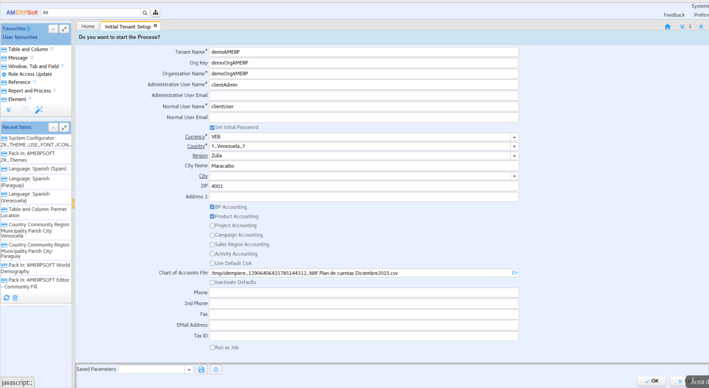
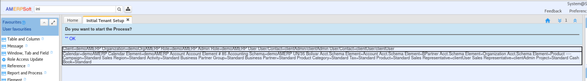
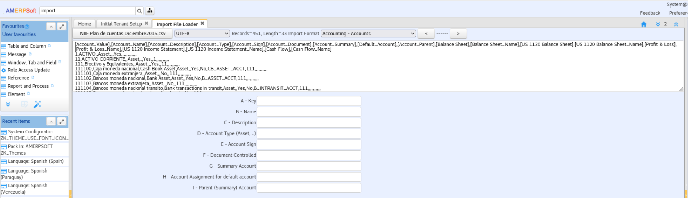
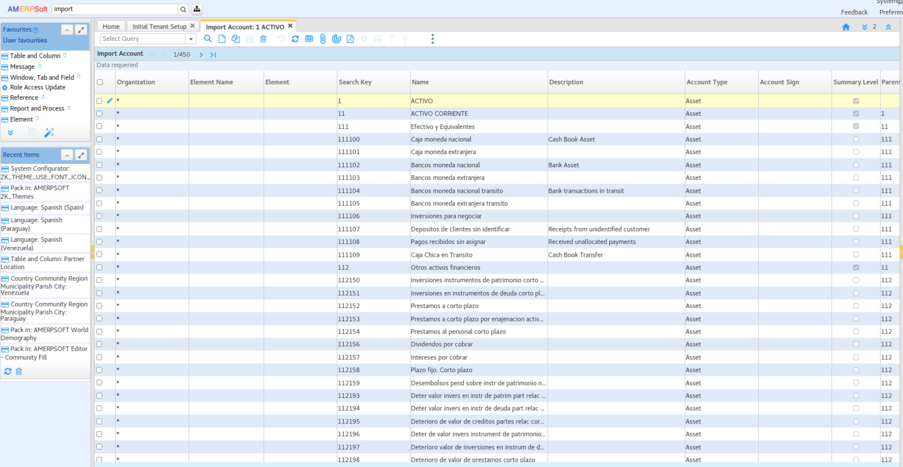
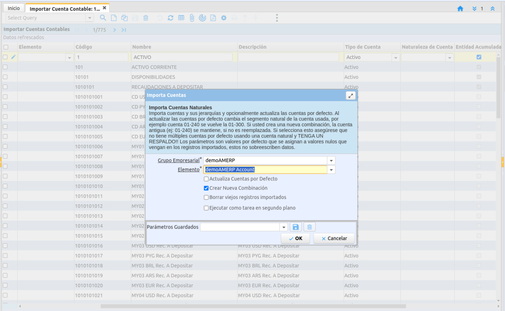
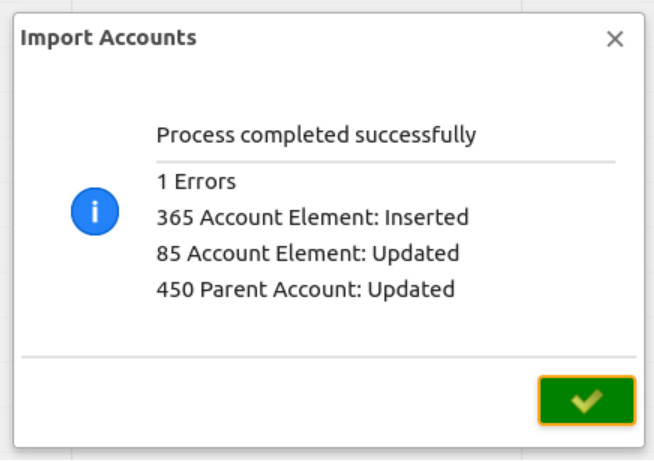
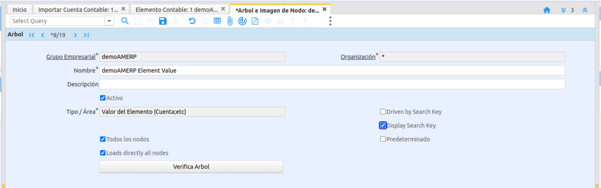
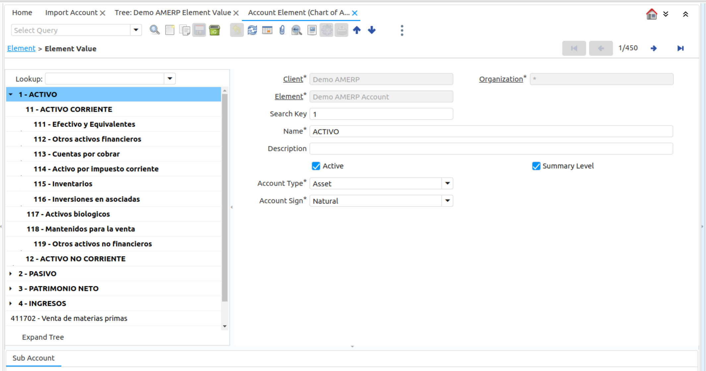

&lArr;[AMERPSOFT-COM PLUGINS](../README_ES.md) | [Home](../README_ES.md)
<br />
<div align="center">
  <a href="AMERPSOFT_logo">
    
  </a>
</div>

<div>
	🇬🇧 <a href="README.md">English</a> | 🇪🇸 Español</a>
</div>

<a name="readme-top"></a>

# Plugin Financiero

## <b>Descripción</b>

El plugin financiero de AMERPSOFT está relacionado con Idempiere Accounting. Este plugin incluye nuevas tareas, procesos e informes.

El sistema contable es la base para el inicio de un cliente y una organización; es el primer paso para comenzar. Se incluye una explicación sobre cómo crear un cliente de demostración.

<b>Contenido:</b>

```texto
- Funciones de la base de datos
- Configuración inicial del cliente
- Instalación del plugin
- Procesos
- Informes contables
- Impuestos
```
Pasos a seguir:

| Pasos | Título | Comentarios |
| ----: | ---------------------------------------------- | ---------------------------------------------------------------------------------- |
| 1 | [Instalar funciones de la base de datos](#step1) | Instalar funciones de la base de datos para PostgreSQL u Oracle |
| 2 | [Configuración inicial del cliente](#step2) | Configuración inicial del cliente: elementos contables y datos básicos para un cliente de demostración |
| 3 | [Instalación del complemento](#step3) | Instalar el complemento mediante la consola OSGI |
| 4 | [Procesos](#step4) | Verificar los procesos instalados |
| 5 | [Informes contables](#step5) | Revisar informes contables |
| 6 | [Importar impuestos financieros](#step6) | Importar categorías de impuestos e impuestos |

## <a name="step1"></a>⭐️1. Instalar funciones de base de datos.
#### Función especial para generar informes de fechas y texto:

```text
* amf_dow2letter.sql
* amf_month2letter.sql
* amf_num2letter.sql
* amf_num2letter1000.sql
```
Usando la consola SQL, ejecute estos scripts. Para Oracle, use SQLDeveloper; para PostgreSQL, use DBeaver.

También Instale `AMF Extended Functions`

Funciones para los reportes financieros. Reducen el codigo de Scrpts SQL.

```text
* amf_org_tree. Query to create function in order to return Organizations.
* amf_element_value_tree_basic. Query to build function that retrieves Element value tree in basic mode.
* amf_element_value_tree_extended. Query to build function that retrieves Element value tree in extended mode with parent 
* amf_balance_account_org. Query for returning  the balance for a given period of an account and an Organization.
* amf_balance_account_org_flex. Query to build function that retrieves balance for a given Period or Date Range for an account and an organization.
* amf_balance_account_org_flex_orgparent. Query to build function that retrieves balance for a given Period or Date Range for an account and an organization parent or organization (flex).
```

<p align="left">(<a href="#readme-top">volver arriba</a>)</p>

## <a name="step2"></a>⭐️2. Configuración inicial del cliente

Antes de instalar el plugin financiero, debe tener un cliente con los elementos contables y el esquema contable adecuados. Puede usar el cliente de jardín, pero se recomienda crear un cliente de demostración con el plan de cuentas adaptado a la contabilidad de su país.

Para más información, consulte en la wiki de Idempiere [Configuración inicial del cliente](https://wiki.idempiere.org/en/Initial_Tenant_Setup_Process_ID-53161) - [Cuentas predeterminadas](https://wiki.idempiere.org/en/Default_Accounts_Usage)

Siga este procedimiento para la configuración inicial del cliente utilizando un ejemplo de elementos contables NIIF.

### 2.1 Seleccionar los planes contables proporcionados

Se proporcionan los siguientes archivos: (LVE NIIF Plan de cuentas Diciembre2015.csv)

- LVE NIIF Plan de cuentas Diciembre2015.csv
- LPY Plan de cuentas 2024.csv

### 2.2 Crear un nuevo cliente

Inquilino inicial.
Como administrador del sistema, inicie el proceso de configuración del inquilino.
Introduzca todos los valores relacionados con el inquilino y la organización. Es muy importante el archivo del plan de cuentas. Aquí se introduce el archivo csv.

<div align="center">
<a href="./install/images/Initial_Tenant_Setup1.png">

</a>
</div>

Inicie el proceso hasta obtener la aprobación final. Esto significa que ha creado completamente el inquilino (cliente) y que todas las cuentas predeterminadas han sido validadas.

<div align="center">
<a href="./install/images/Initial_Tenant_Setup2.png">

</a>
</div>

A continuación, Importar cuentas.

### 2.3 Importar elementos de cuenta

Inicie sesión como usuario administrador del inquilino y vaya a la ventana <b>Importar cargador de archivos</b>.

Seleccione el archivo a cargar (el mismo archivo CSV utilizado para la configuración inicial del inquilino). Seleccione también el formato de importación (Contabilidad - Cuentas) y ejecute la importación.

Recibirá un mensaje final con el número de cuentas importadas. En este ejemplo (451).

<div align="center">
<a href="./install/images/Import_Accounts1.png">

</a>
</div>

Como usuario administrador del inquilino, vaya a "Importar cuentas". Se importarán los registros, pero normalmente el primero estará vacío y deberá eliminarlo.

Puede revisar todos los registros importados.

<div align="center">
<a href="./install/images/Import_Accounts2.png">

</a>
</div>

Ejecute el proceso "Importar cuentas", seleccione Cliente y Elemento. El resto de las entradas conservan los valores predeterminados.

<div align="center">
<a href="./install/images/Import_Accounts3.png">

</a>
</div>

Verifique las importaciones y los errores revisando la columna "Mensajes de error de importación".

<div align="center">
<a href="./install/images/Import_Accounts4.png">

</a>
</div>

Cambie la configuración del árbol de cuentas en la ventana "Árbol". Marque la opción "Mostrar clave de búsqueda".

<div align="center">
<a href="./install/images/Accounts_Tree_Settings.png">

</a>
</div>

Revisa los elementos de la cuenta.

<div align="center">
<a href="./install/images/Account_Elements.png">

</a>
</div>

<p align="left">(<a href="#readme-top">volver arriba</a>)</p>

## <a name="step3"></a>⭐️3. Instalar el plugin financiero

<b>Instalar el plugin mediante la consola web Apache Felix</b>

```texto
- Descargar el archivo jar del plugin del repositorio.
(Nombre: org.amerpsoft.lve.idempiere.financial_12.0.0.202404091015.jar)
- Instalar mediante la consola web Apache Felix de Osgi
- o cualquier procedimiento manual
- Verificar que el plugin esté funcionando y actualizado
```

<b>Empaquetar AMERPSFOT Financial.zip</b>

```texto
1. Descargar ‘AMERPSOFT Financial.zip’
2. Empaquetar usando el diccionario de la aplicación --> Menú Empaquetar
3. Ejecutar Sincronizar terminología, Comprobación de secuencia y Actualización de acceso de rol
4. Reiniciar el servidor
```
<b>Realizar cambios</b>

Usando el diccionario de la aplicación para menús y procesos, cree traducciones para su idioma. En caso de español, puede copiar las traducciones de es_CO (Colombia).

Procesos Financieros de AMERPSOFT.

** IMPORTANTE **
El logotipo de la empresa se muestra en la mayoría de los informes.

Para actualizar, vaya a "Administración del Sistema / Reglas del Inquilino / Inquilino". En la pestaña "Información del Inquilino", actualice los campos "Logotipo" e "Informe del Logotipo" con la imagen de su empresa.

Verifique los menús de informes y procesos creados.

```texto
- Proceso de Amfin: Reinicio Contable
- Proceso de Amfin: Recontabilización Contable
- Proceso de Amfin: Cierre Anual del GLJournal
```

Informes Financieros de AMERPSOFT

```texto
- Elementos de Cuenta de Amfin, Jasper
- Balance de Comprobación de Amfin, Jasper, un Período
- Balance de Comprobación de Amfin, Jasper, por Dos Fechas
- Balance Financiero Estatal de Amfin, Jasper
- Resultados Integrales Financieros Estatales de Amfin, Jasper
```

<p align="left">(<a href="#readme-top">volver arriba</a>)</p>

## <a name="step4"></a>⭐️4. Procesos.

Procesos Financieros de AMERPSOFT

```texto
- Proceso de Amfin: Restablecer Contabilidad: Restablecer cuentas de hechos ** Verificar **
- Proceso de Amfin: Recontabilización de Contabilidad: Este proceso recontabiliza un tipo de documento en un período determinado.
- Proceso de Amfin: Cierre Anual del Diario General: Este proceso genera un Diario General para el cierre anual.
```
<p align="left">(<a href="#readme-top">volver arriba</a>)</p>

## <a name="step5"></a>⭐️5. Informes Contables

Informes Financieros de AMERPSOFT

```texto
- Elementos de Cuenta Amfin Jasper
- Balance de Comprobación Amfin Jasper, Un Período
- Balance de Comprobación Amfin Jasper, Dos Fechas
- Balance Financiero Estatal Amfin Jasper
- Resultados Integrales Financieros Estatales Amfin Jasper
```

Estos informes se han probado con una base de datos PostgreSQL. Las versiones para Oracle estarán disponibles próximamente.

Ejemplos de PDF:

- [Elementos de la Cuenta](./install/pdf/CatalogoElementosCuenta.pdf)
- [Balance Financiero del Estado](./install/pdf/BalanceSituacionFinanciera.pdf)
- [Resultados Integrales del Estado Financiero](./install/pdf/EstadoResultadosIntegrales.pdf)
- [Balance de Comprobación](./install/pdf/BalanceComprobacionPeríodo.pdf)

<p align="left">(<a href="#readme-top">volver arriba</a>)</p>

## <a name="step6"></a>⭐️6- Importar Impuestos Financieros de AMERPSOFT.</b>

Usando el paquete de Diccionario de la Aplicación <b>Impuestos Financieros de AMERPSOFT</b> como usuario del sistema.
Este paquete modifica la tabla C_TaxCategory como se explica en el archivo de Excel 'tablesFinancial.xlsx'. También se modifica la ventana para la categoría de impuestos, por lo que podremos importarlos.

Ingresando como usuario inquilino y seleccionando la opción de importar impuestos del cliente, en este orden:

- Importar el archivo CSV "C_TaxCategory" correspondiente a su localización.

- Importar el archivo CSV "C_Tax" correspondiente a su localización.

Si es necesario, debe crear un archivo CSV adecuado o ingresar manualmente las categorías e impuestos de impuestos.
** Es importante seguir este paso con el plugin de retención.

<p align="left">(<a href="#readme-top">volver arriba</a>)</p>

<!-- CONTACTO -->
## Contacto

Estos plugins y tutoriales son cortesía de Luis Amesty de [Amerpsoft Consulting](http://amerpsoft.com/).

Para cualquier pregunta o mejora, contáctame en: [Idempiere WIKI](https://wiki.idempiere.org/en/User:Luisamesty)

<p align="left">(<a href="#readme-top">volver arriba</a>)</p>

## Requiere la versión 12 de Idempiere

Consulta la rama de la versión 12 para más detalles.

<p align="left">(<a href="#readme-top">volver arriba</a>)</p>
