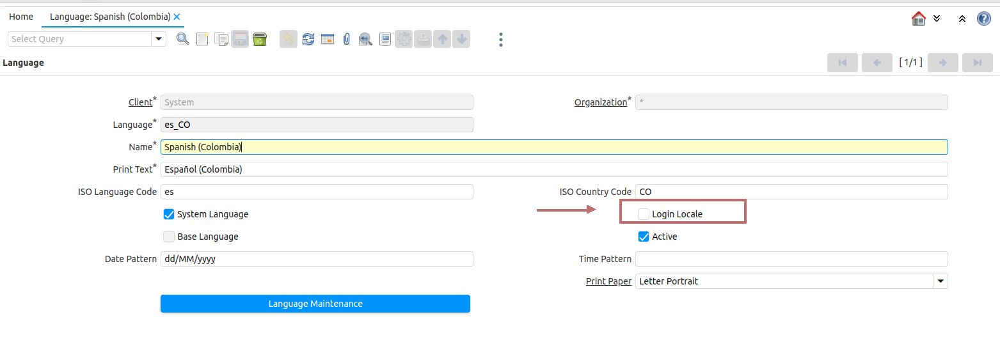

&lArr;[COMMUNITY PLUGINS](../README.md) | [Home](../README.md)

<a name="readme-top"></a>

# <b>Languages</b>

Idempiere is able to show web interfaces in different languages. You must configure Langages using appropiate installation packs.
As a example you may see wiki page [Install_german_language_Pack](https://wiki.idempiere.org/en/Install_german_language_Pack). Also, you could find different Languages packs in [Translation page](https://wiki.idempiere.org/en/Translations).

In this case we are concerned with the Spanish Language. We have different locations depending on the country. For example Venezuela, Paraguay, Spain, etc. Spanish locations have many similarities and small differences, this is the reason why we copy the translations and adjust the differences.

Follow these instructions to define a Spanish language similar to the default Idempiere 'Seed'.

## <b>Spanish Language Installation </b>

Follow these steps in order to define a new System Language in your Idempiere System.
Language table contains most of Languages and Localizations. For example for Spanish there are different Localization for the different countries.
We have:

```text
- es_ES for Spain.
- es_VE for venezuela
- es_PY for Paraguay
..
- es_CL for Chile
```
In the default database provided for Idempiere we only have <b>en_US</b> and <b>es_CO</b> as System Languages.
System Languages provides possibility to translate Elements, Fields, Tables, Messages and all different entities in Didempiere.
In Spanish Localizations, we have basically the same structure, but we could identify only small differences. 

For these reasons, i have done a Script to copy (clone) from es_CO provided from Seed, to the selected localization es_XX, and in the next future, we could make minor changes in our Application Dictionary.
	
### <b>1- Set Spanish es_XX as System language</b>
```text
- Login idempiere as System in English
- Go to Menu: /System Admin/General Rules/System Rules/Language
- On Window Language: Locate es_ES, es_VE, es_PY.  Or your preferred Language xx_XX
- On Window Language: Check System Language
- On Window Language: Execute 'Language Mantenance' Process
    ( If you are using other Locale adjust to your)
```

### <b>2- Create Language extension for es_VE or xx_XX</b>
```text
- Download Scripts from Repository (See This plugin documentation directory)
- Example:  Create-language-from-es-CO-to-es-VE.sql" Script
- Execute Query on a SQL Console. SQLDeveloper for Oracle, DBeaver for PostgreSQL environment.
  (Recommended to do it in partial queries, or executing a file)
- You may edit this Query for your favourite Language xx_XX
- Remember to do Syncronize Terminology
```

### <b>3- Manual changes on some Translation</b>

Manually translate the labels associated with regions, municipalities and parishes. Also the possible language differences that exist.
For example:
```text
- Goto 'Application Dictionary/Messages' and Locale for Region, Municipality and Parish.
- Change for Paraguay to Departamento/ Distrito /Barrio.
- Change for Venezuela to Estado / Municipio / Parroquia.

These tags are important to change, because they are used on Entended Location Window when you select a Language different to English.
```

### <b>4-Manually Translate Language record for your es_XX</b>

Menu (System Admin/General Rules/SystemRules/Language)

```text
Modify 'Print Text' Field and Translate to your selected Language (Spanish for example). 
Español (España)  for es_ES
Español (Paraguay)  for es_PY
Español (Venezuela)  for es_VE
```

### <b>5-Enable/Disable Login Language</b>

Menu (System Admin/General Rules/SystemRules/Language)

Go to Specific Language, as an example 'es_CO'.

On <b>'Login Locale'</b> Field:

```text
Check for Login Enabled.
Uncheck for Login Disabled
```


<div align="left">
  <a href="ISO_CODE">
    
  </a>
</div>

<p align="left">(<a href="#readme-top">back to top</a>)</p>
