&lArr;[COMMUNITY PLUGINS](../README.md) | [Home](../README.md)
<div style="text-align: right;">

🇬🇧 English | 🇪🇸 [Español](./README_ES.md)  

</div>


<br />
<div align="center">
  <a href="AMERPSOFT_logo">
    
  </a>
</div>

<a name="readme-top"></a>

# AMERPSOFT Personnel and Payroll Plugin

## <b>Description</b>


AMERPSOFT Personnel and Payroll Plugin is related to Idempiere processes related with Employees. This plugin includes some new tasks, processes and reports.

This plugin is a complete new module, initially adapted to Venezuelan legislation and with the possibility of adapting it to any other legislation through Processes and Concept Formulas in Javascript Language.

A data dictionary is used through the set of tables ‘AMN_’, which are part of the AMERP localization.


<b>Content:</b>

```text
- Initial installation procedures
- Installing plugin
- Processes
- Payroll Reports
```
Follow steps:

| Steps | Title                                          | Comments                                                                         |
| ----: | ---------------------------------------------- | -------------------------------------------------------------------------------- |
|     1 | [Initial installation procedures](#step1)      | Initial installation procedures                              				    |
|     2 | [Installing plugin](#step2)                 	 | Installing plugin          														|
|     3 | [Configuring basic tables](#step3)             | Configuring basic tables                                                			|
|     4 | [Processes](#step4)                            | Verify processes installed                                                         |
|     5 | [Personnel and Payroll Reports](#step5)                   | Review Personnel and Payroll reports Reports                                                          |
                                                 |


## <a name="step1"></a>⭐️1.	Initial installation procedures.

It is recommeded to install Extended Editor, LCO, BuParteners ans Financial plugins before installing this one.

You may download jar file from repository or generate from sources.
Jar file name is like: org.amerpsoft.com.idempiere.personnelpayroll_11.0.0.202408050959.jar


<p align="left">(<a href="#readme-top">back to top</a>)</p>

## <a name="step2"></a>⭐️2. Installing plugin

Before installing plugin be sure all SQL Scripts were applied to database.

See:

```text

sql/postgresql/css_styles.sql

or 

sql/oracle/css_styles.sql
```

Install plugin using Apache Felix.

```text
	- Download plugin jar file from Repository.
    (Named as: org.amerpsoft.com.idempiere.personnelpayroll_11.0.0.202408050959.jar )
	- Install using Osgi Apache Felix Web Console
	- or Any Manual procedure
	- Verify plugin is running and updated
```

<div align="center">
  <a href="AMERPSOFT_logo">
    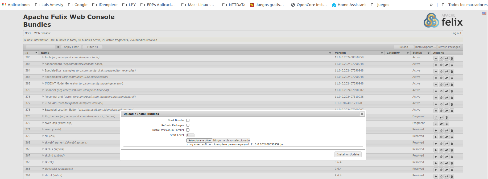
  </a>
</div>


<b>Verify Pack-IN /Pack-OUT were propertly created. AMERPSFOT Personnel and Payroll # 1 to 6.zip</b>

<div align="center">
  <a href="AMERPSOFT_logo">
    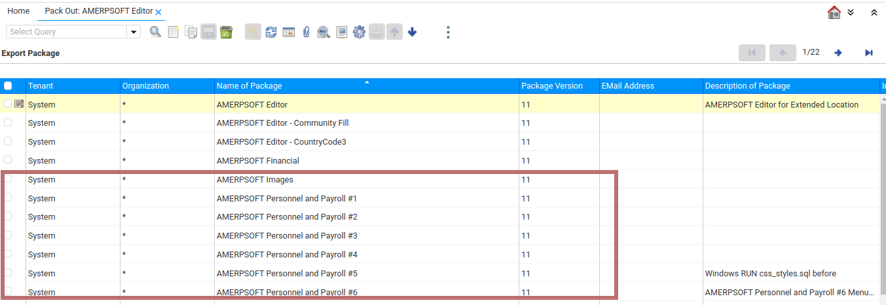
  </a>
</div>


<p align="left">(<a href="#readme-top">back to top</a>)</p>

## <a name="step3"></a>⭐️3. Configuring basic tables 

<b>Rates</b>

<div align="center">
  <a href="AMERPSOFT_logo">
    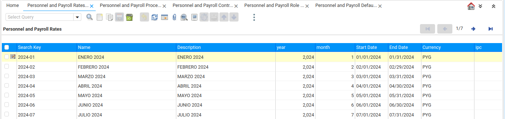
  </a>
</div>

<b>Processes</b>

<div align="center">
  <a href="AMERPSOFT_logo">
    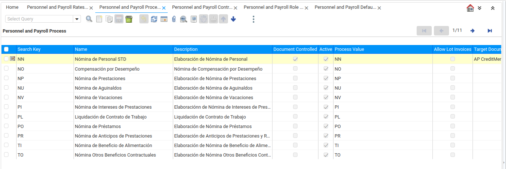
  </a>
</div>

<b>Contracts</b>

<div align="center">
  <a href="AMERPSOFT_logo">
    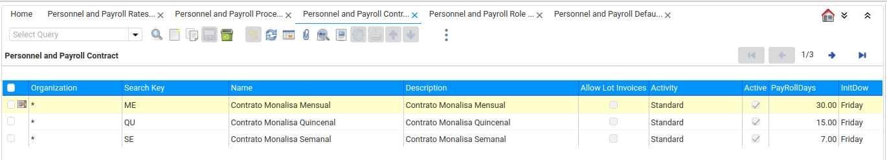
  </a>
</div>

<b>Roles</b>

<div align="center">
  <a href="AMERPSOFT_logo">
    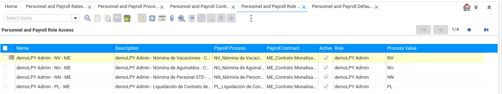
  </a>
</div>

<b>Default account combinations</b>

<div align="center">
  <a href="AMERPSOFT_logo">
    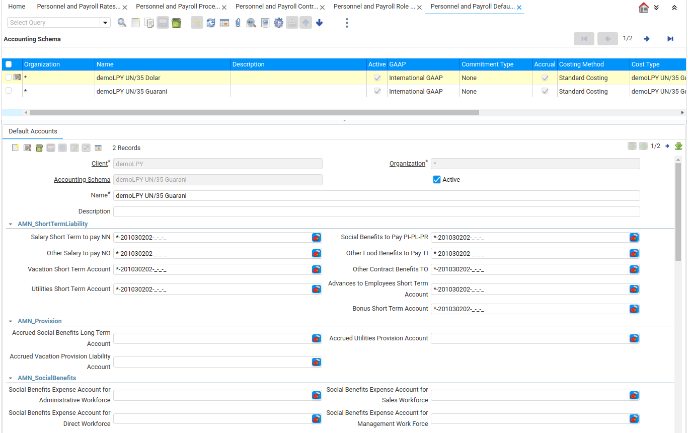
  </a>
</div>

<b>Concepts</b>

<div align="center">
  <a href="AMERPSOFT_logo">
    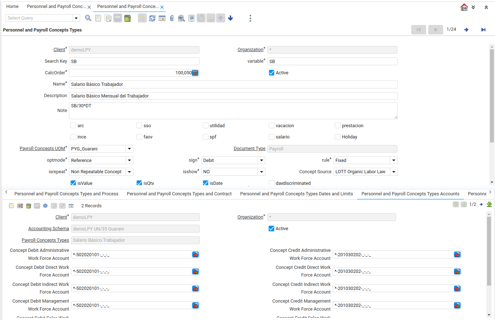
  </a>
</div>

<b>Concepts Unit of Measure</b>

<div align="center">
  <a href="AMERPSOFT_logo">
    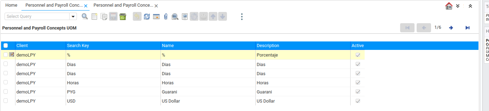
  </a>
</div>

<b>Additional Tables</b>

<div align="center">
  <a href="AMERPSOFT_logo">
    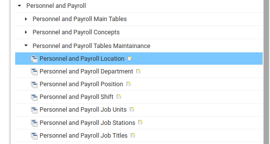
  </a>
</div>

<b>Employees</b>

<div align="center">
  <a href="AMERPSOFT_logo">
    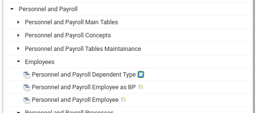
  </a>
</div>

<p align="left">(<a href="#readme-top">back to top</a>)</p>

## <a name="step4"></a>⭐️4. Personnel and Payroll Processes. 

AMERPSOFT Personnel and Payroll  Processes

Verify these processes are installed on menu:

<b>Processes</b>

<div align="center">
  <a href="AMERPSOFT_logo">
    
  </a>
</div>

<p align="left">(<a href="#readme-top">back to top</a>)</p>

## <a name="step5"></a>⭐️5. Personnel and Payroll Reports 

AMERPSOFT Personnel and Payroll Reports

Verify these reports are installed on menu:

<b>Reports</b>

<div align="center">
  <a href="AMERPSOFT_logo">
    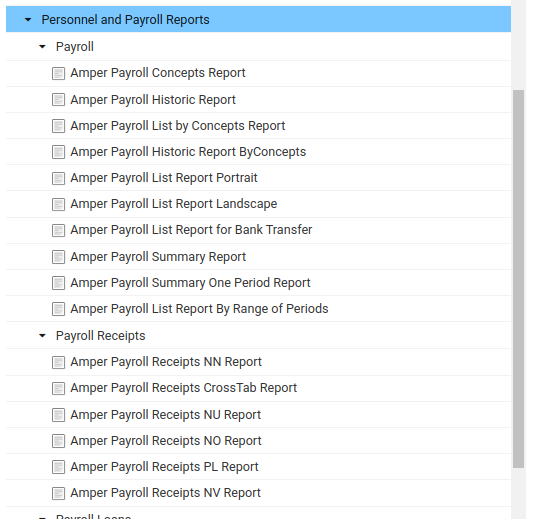
  </a>
</div>
```

These reports have been tested with Postgresql database.


<p align="left">(<a href="#readme-top">back to top</a>)</p>


## Requires Idempiere Release 11 

  Under Test - See release-11 branch for more details.

<p align="left">(<a href="#readme-top">back to top</a>)</p>

