&lArr;[AMERPSOFT-COM PLUGINS](../README_ES.md) | [Home](../README_ES.md)

<br />

<div style="text-align: right;">

🇬🇧 [English](./README.md) | 🇪🇸 Español

</div>

<div align="center">
<a href="AMERPSOFT_logo">

</a>
</div>

<a name="readme-top"></a>

# Plugin de Personal y Nómina AMERPSOFT

## <b>Descripción</b>

El **Plugin de Personal y Nómina AMERPSOFT** está relacionado con los procesos de Idempiere para empleados. Este plugin incluye nuevas tareas, procesos e informes.

Es un módulo completamente nuevo, adaptado inicialmente a la legislación venezolana y con la posibilidad de adaptarse a cualquier otra legislación a través de Procesos y Fórmulas de Conceptos en lenguaje Javascript.

Se utiliza un diccionario de datos a través del conjunto de tablas 'AMN_', que forman parte de la localización AMERP.

**Contenido:**

```text
- Procedimientos de instalación inicial
- Instalación del plugin
- Procesos
- Informes de nómina
```

Siga los pasos:

| Pasos | Título                                         | Comentarios                                                              |
| ----: | ---------------------------------------------- | ------------------------------------------------------------------------ |
|     1 | [Procedimientos de instalación inicial](https://www.google.com/search?q=%23step1) | Procedimientos de instalación inicial                                    |
|     2 | [Instalación del plugin](https://www.google.com/search?q=%23step2)                 | Instalación del plugin                                                   |
|     3 | [Configuración de tablas básicas](https://www.google.com/search?q=%23step3)      | Configuración de tablas básicas                                          |
|     4 | [Procesos](https://www.google.com/search?q=%23step4)                             | Verificación de los procesos instalados                                  |
|     5 | [Informes de Personal y Nómina](https://www.google.com/search?q=%23step5)         | Revisión de los informes de Personal y Nómina                            |

## <a name="step1"></a>⭐️1. Procedimientos de instalación inicial.

Se recomienda instalar los plugins Extended Editor, LCO, BuParteners y Financial antes de instalar este.

Puede descargar el archivo jar desde el repositorio o generarlo desde las fuentes.
El nombre del archivo jar es similar a: `org.amerpsoft.com.idempiere.personnelpayroll_11.0.0.202408050959.jar`

<p align="left">(<a href="#readme-top">volver arriba</a>)</p>

## <a name="step2"></a>⭐️2. Instalación del plugin

Antes de instalar el plugin, asegúrese de que todos los scripts SQL se hayan aplicado a la base de datos.

Ver:

```text
sql/postgresql/css_styles.sql

o

sql/oracle/css_styles.sql
```

Instale el plugin usando Apache Felix.

```text
	- Descargue el archivo jar del plugin desde el Repositorio.
    (Llamado: org.amerpsoft.com.idempiere.personnelpayroll_11.0.0.202408050959.jar )
	- Instálelo usando la Consola Web de Osgi Apache Felix
	- o cualquier otro procedimiento manual
	- Verifique que el plugin esté funcionando y actualizado
```

<div align="center">
<a href="AMERPSOFT_logo">
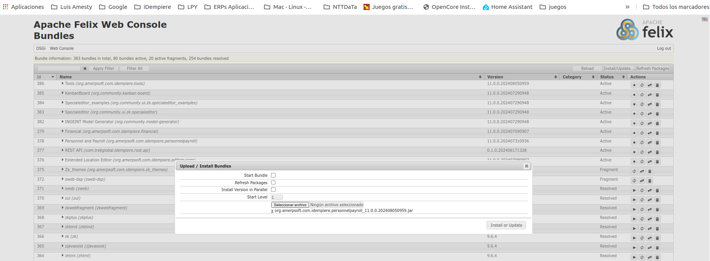
</a>
</div>

**Verifique que los Pack-IN / Pack-OUT se hayan creado correctamente. AMERPSFOT Personnel and Payroll # 1 to 6.zip**

<div align="center">
<a href="AMERPSOFT_logo">
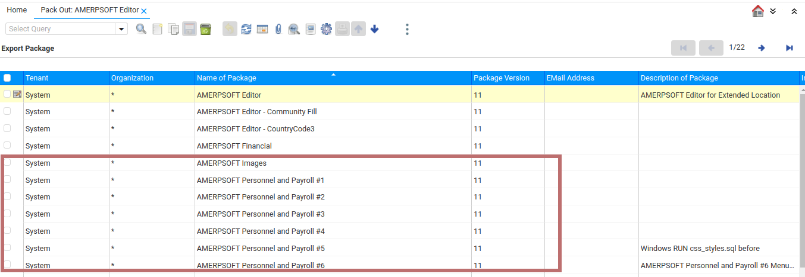
</a>
</div>

<p align="left">(<a href="#readme-top">volver arriba</a>)</p>

## <a name="step3"></a>⭐️3. Configuración de tablas básicas

**Tasas**

<div align="center">
<a href="AMERPSOFT_logo">
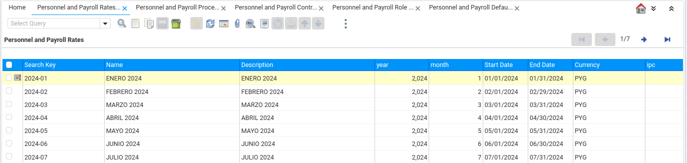
</a>
</div>

**Procesos**

<div align="center">
<a href="AMERPSOFT_logo">
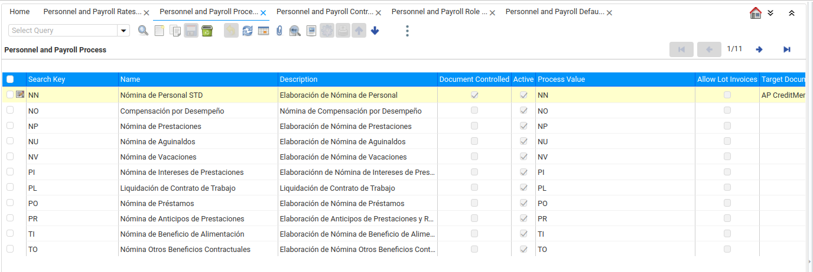
</a>
</div>

**Contratos**

<div align="center">
<a href="AMERPSOFT_logo">
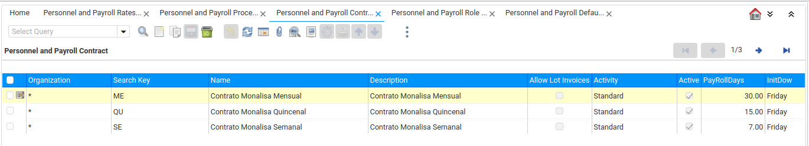
</a>
</div>

**Roles**

<div align="center">
<a href="AMERPSOFT_logo">
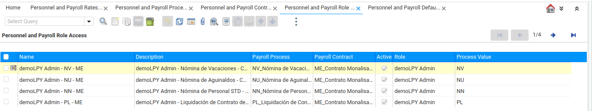
</a>
</div>

**Combinaciones de cuentas predeterminadas**

<div align="center">
<a href="AMERPSOFT_logo">
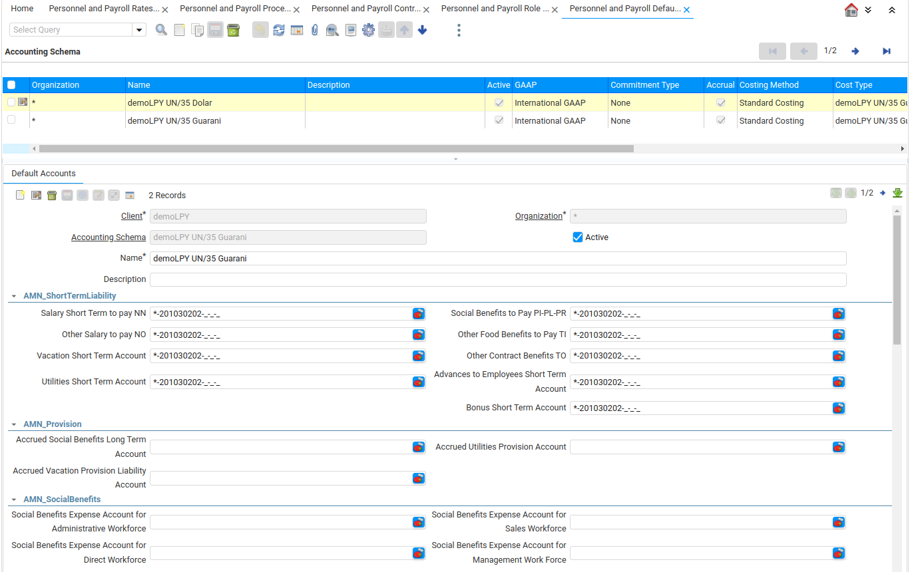
</a>
</div>

**Conceptos**

<div align="center">
<a href="AMERPSOFT_logo">
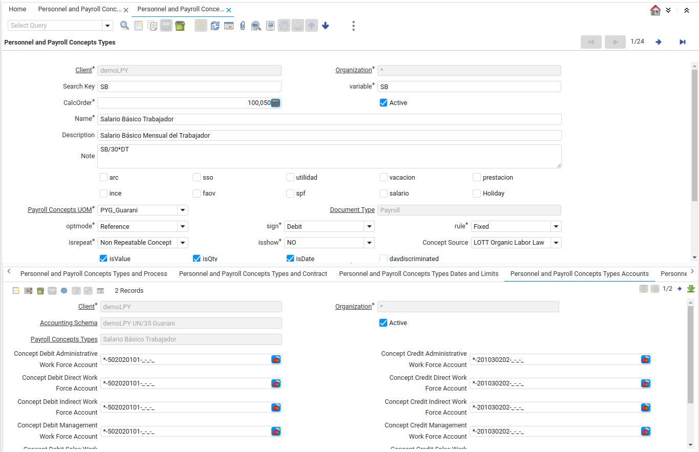
</a>
</div>

**Unidad de Medida de Conceptos**

<div align="center">
<a href="AMERPSOFT_logo">
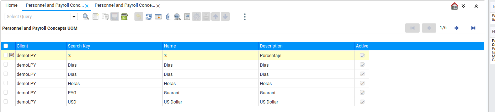
</a>
</div>

**Tablas Adicionales**

<div align="center">
<a href="AMERPSOFT_logo">
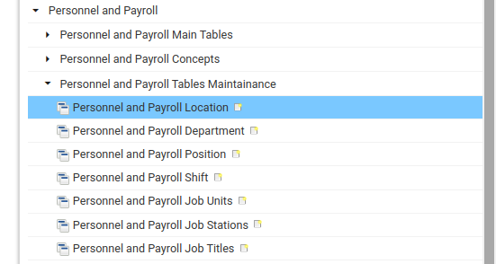
</a>
</div>

**Empleados**

<div align="center">
<a href="AMERPSOFT_logo">
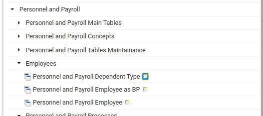
</a>
</div>

<p align="left">(<a href="#readme-top">volver arriba</a>)</p>

## <a name="step4"></a>⭐️4. Procesos de Personal y Nómina.

Procesos de Personal y Nómina de AMERPSOFT

Verifique que estos procesos estén instalados en el menú:

**Procesos**

<div align="center">
<a href="AMERPSOFT_logo">
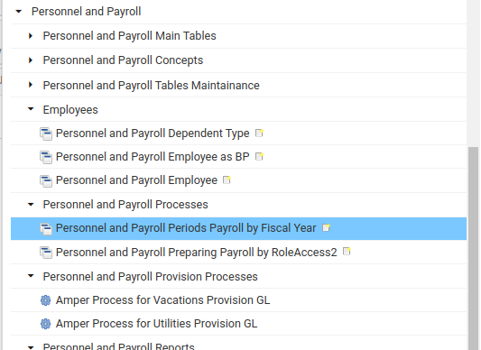
</a>
</div>

<p align="left">(<a href="#readme-top">volver arriba</a>)</p>

## <a name="step5"></a>⭐️5. Informes de Personal y Nómina

Informes de Personal y Nómina de AMERPSOFT

Verifique que estos informes estén instalados en el menú:

**Informes**

<div align="center">
<a href="AMERPSOFT_logo">
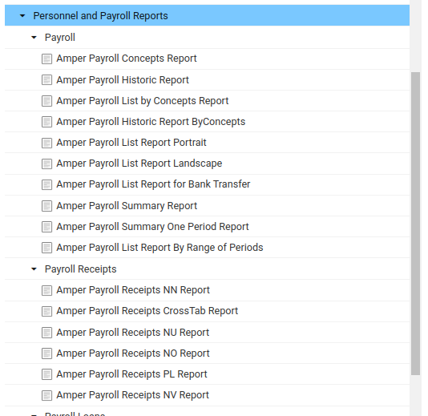
</a>
</div>

Estos informes han sido probados con la base de datos Postgresql.

<p align="left">(<a href="#readme-top">volver arriba</a>)</p>

## Requiere Idempiere Versión 12

Ver la rama `release-12` para más detalles.

<p align="left">(<a href="#readme-top">volver arriba</a>)</p>
```