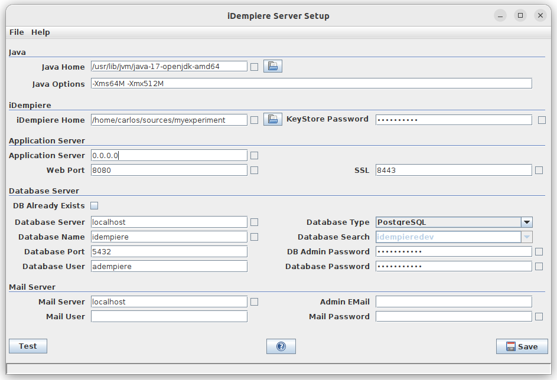

&lArr;[Installing Idempiere](../README.md)
<a name="readme-top"></a>

## Install Idempiere in Ubuntu 22.04


Install Procedures for Ubuntu 22.04 with PosgreSQL Database.

This procedure is applied for an installation on two different machines.

- Database machine
- Host idempiere machine

This is recommended approach, but if you have one machine all procedures must be done in the same machine.

This procedure includes information taken from  [Installing iDempiere](https://wiki.idempiere.org/en/Installing_iDempiere).  Wiki page brought to you by [Carlos Ruiz](https://wiki.idempiere.org/en/User:CarlosRuiz) from [BX Service](https://www.bx-service.com/).

| Steps | Link                                           | Where             | Comments                                                        |
| ----: | ---------------------------------------------- | ----------------- | --------------------------------------------------------------- |
|     1 | [Install PostgreSQL 15](#step1)                | Dabase machine    | Install postgresql from Ubuntu distribution. Update repository. |
|     2 | [Config PostgreSQL 15 ](#step2)                | Database machine  | Edit pg_hba.conf / postgresql.conf files                        |
|     3 | [Install JAVA OpenJDK17 ](#step3)              | Idempiere machine | Download and install Java 17                                    |
|     4 | [Download Installers ](#step4)                 | Idempiere machine | Download installers from iDempiere repository                   |
|     5 | [Install idempiere11 from Installers ](#step5) | Idempiere machine | Unzip and copy Installers in /opt directory                     |
|     6 | [Running idempiere11 ](#step6)                 | Idempiere machine | Run Configure auto execute idempiere                            |

### <a name="step1"></a>1-⭐️Install PostgreSQL 15

#### **DATABASE MACHINE**

````
Install in the machine that it is executing DDBB.
$ ssh root@maquina-postgresql.com -p 22
````

#### Install the repository:

To use the apt repository, follow these steps:

```
# Create the file repository configuration:
$ sudo sh -c 'echo "deb http://apt.postgresql.org/pub/repos/apt $(lsb_release -cs)-pgdg main" > /etc/apt/sources.list.d/pgdg.list'
# Import the repository signing key:
$ wget --quiet -O - https://www.postgresql.org/media/keys/ACCC4CF8.asc | sudo apt-key add -
# Update the package lists:
$ sudo apt-get update
```

#### Install PostgreSQL

````
# Install the version 15 of PostgreSQL.
$ sudo apt-get -y install postgresql-15
or
# For last version 16
$ sudo apt-get -y install postgresql
````

#### Optionally initialize the database and enable automatic start:

````
sudo systemctl enable postgresql-15
sudo systemctl start postgresql-15
````

<p align="left">(<a href="#readme-top">back to top</a>)</p>

### <a name="step2"></a>2-⭐️Configure PostgreSQL 15

#### Modify ***ph_hba.conf*** file

Afterinstalling postgres you must check the correct configuration of:

*/etc/postgresql/15/main/pg_hba.conf*

Thefollowing line requires change of the authentication method:

```
local   all             all                                     peer
CHANGE TO:
local   all             all                                     scram-sha-256
```

Addremote connection for your ip

```
# IPv4 local connections:
host    all             all             127.0.0.1/32            scram-sha-256
host    all             all             83.49.112.218/32           scram-sha-256
```

#### Modify postgresql.conf file

For development open Listen address ‘*’ , for production localhost.

Port 5432/5433.

Edit: ‘/etc/postgresql/15/main/postgresql.conf'

```
#------------------------------------------------------------------------------
# CONNECTIONS AND AUTHENTICATION
#------------------------------------------------------------------------------
# - Connection Settings -
listen_addresses = '*'         # what IP address(es) to listen on;
                                        # comma-separated list of addresses;
                                        # defaults to 'localhost'; use '*' for all
                                        # (change requires restart)
port = 5432                             # (change requires restart)
max_connections = 100                   # (change requires restart)
#superuser_reserved_connections = 3     # (change requires restart)
```

#### Change Administrator Password

```
# Machine:
user@linux:$  sudo su postgres
postgres@linux:/root/$ psql -U postgres
# PostgreSQL Commands:
Postgres-#  ALTER USER postgres PASSWORD 'your_chosen_password';
```

#### Firewall update (Optional)

If there is a firewall installed update port.

```
$ sudo ufw allow 5432
$ sudo ufw allow 5433
```

#### Create Users

User: adempiere and any other required

Execute Postgres ON LINUX  Port 5432 - 5433 or 5434

```
$ sudo -u postgres psql -p 5432 template1
```

On PostgreSQL Command lines:

```
# CREATE ROLE adempiere SUPERUSER LOGIN PASSWORD 'adempiere';
# CREATE ROLE luisamesty SUPERUSER LOGIN PASSWORD '5167830';
# \q
```

And then reload the configuration ON LINUX:

```
$ sudo service postgresql reload
```

Create Database idempiereSeed11 and Production

Execute Postgres ON LINUX  Port 5432 - 5433 or 5434

```
$ sudo -u postgres psql -p 5432 template1
```

Queries to Kill conetions, if necessary when running PostgreSQL Clients.

```
SELECT    pg_terminate_backend(pg_stat_activity.pid)
FROM    pg_stat_activity
WHERE    pg_stat_activity.datname = 'database_name' AND pid <> pg_backend_pid();
SELECT    pg_terminate_backend(pid)
FROM    pg_stat_get_activity(NULL::integer)
WHERE    datid = ( SELECT  oid FROM pg_database WHERE  datname = 'database_name');
```

On PostgreSQL Command lines:

```
-- DROP IF NECESSARY ONLY
# DROP DATABASE "idempiereSeed11";
# CREATE DATABASE "idempiereSeed11"
  WITH OWNER = adempiere  ENCODING = 'UTF8' TABLESPACE = pg_default  CONNECTION LIMIT = -1;
# ALTER DATABASE "idempiereSeed11"     SET search_path TO adempiere;
```

Restore from Seed or Production Backup, execute ON LINUX:

```
# Adempiere_pg.dmp for Seed, for production use your backup dmp
# Adempiere_pg.jar on directory idempiere/org.adempiere.server-feature/data/seed/
# Unzip to dmp
$ jar -xvf Adempiere_pg.jar 
# PostgreSQL on Linux Ubuntu located on /usr/lib/postgresql/15/bin
$ /usr/lib/postgresql/15/bin/psql -p 5432 -d idempiereSeed12 -f Adempiere_pg.dmp
```

#### EXIT Postgres

On PostgreSQL Command lines:

```
# \q
```

<p align="left">(<a href="#readme-top">back to top</a>)</p>

### <a name="step3"></a>3-⭐️Install JAVA OpenJDK17

#### Install JAVA OpenJDK17 On Idempiere Machine.

OpenJDK has separate packages for JDK (Java Development Kit) for developing Java applications and JRE (Java Runtime Environment) for running Java applications.

First, update the repository index ON LINUX.

```
$ sudo apt update
```

Then, install the OpenJDK or JRE package as per the requirement.
OpenJDK 17 JDK

```
$ sudo apt install -y openjdk-17-jdk
```

OpenJDK 17 JRE

```
$ sudo apt install -y openjdk-17-jre
```

#### Install Oracle JDK 17 On Ubuntu 22.04

This is not needed for idempiere , just for information.

First, install dependencies for Oracle JDK 17 installation ON LINUX.

```
$ sudo apt update
$ sudo apt install -y libc6-x32 libc6-i386
```

Then, download Oracle Java JDK 17 using the wget command in the terminal.

```
$ wget https://download.oracle.com/java/17/latest/jdk-17_linux-x64_bin.deb
```

Finally, install Oracle Java JDK 17 using the dpkg command.

```
$ sudo dpkg -i jdk-17_linux-x64_bin.deb
```

In some cases, you may need to install Oracle JDK 17 on the PATH location.

```
$ sudo update-alternatives --install /usr/bin/java java /usr/lib/jvm/jdk-17/bin/java 1
```

#### Verify Java JDK Installation

After installing JDK, use the below command to verify the version.

```
$ java -version
```

Output:

```
java version "17.0.3" 2022-04-19 LTS
Java(TM) SE Runtime Environment (build 17.0.3+8-LTS-111)
Java HotSpot(TM) 64-Bit Server VM (build 17.0.3+8-LTS-111, mixed mode, sharing)
```

<p align="left">(<a href="#readme-top">back to top</a>)</p>

### <a name="step4"></a>4-⭐️Download Installers

iDempiere version 11 is maintained and stable. This is the recommended version to install for implementation and production purposes.

You can find daily installers for this version at:

https://sourceforge.net/projects/idempiere/files/v11/daily-server/

Download the latest with these commands ON LINUX:

```
$ wget https://sourceforge.net/projects/idempiere/files/v11/daily-server/idempiereServer11Daily.gtk.linux.x86_64.zip
$ wget https://sourceforge.net/projects/idempiere/files/v11/daily-server/idempiereServer11Daily.gtk.linux.x86_64.zip.MD5
$ md5sum -c idempiereServer11Daily.gtk.linux.x86_64.zip.MD5
```

<p align="left">(<a href="#readme-top">back to top</a>)</p>

### <a name="step5"></a>5-⭐️Install idempiere11 from Installers

#### Create user

It is recommended to run the iDempiere server as a user created for such purpose, usually idempiere, instead of running as root.

ON LINUX:

```
$ adduser idempiere
```

Install Server

Unzip the server installer you downloaded or created, for example:

```
$ jar xvf idempiereServer11Daily.gtk.linux.x86_64.zip
```

Move the folder to /opt

```
$ mv idempiere.gtk.linux.x86_64/idempiere-server /opt
$ rmdir idempiere.gtk.linux.x86_64
$ chown -R idempiere:idempiere /opt/idempiere-server
```

From now on is preferable that you run everything as idempiere user:

```
$ su - idempiere  # not necessary if you're already as user idempiere
$ cd /opt/idempiere-server
```

Graphical You can run ON LINUX:

```
$ sh setup.sh
```



or Command run ON LINUX

```
sh console-setup-alt.sh
```

NOTE:  On command you must enter each value line per line. Optionally you can add a LOG LEVEL parameter (accepted values are: OFF, SEVERE, WARNING, INFO, CONFIG, FINE, FINER, FINEST, ALL). For example sh setup-alt.sh FINE

You can fill the parameters as shown in the screenshot, or with your own preferred values, specially you must take care of the following:

```
Java Home: /usr/lib/jvm/jdk-17-oracle-x64
Java Options: -Xms64M -Xmx512M
iDempiere Home: This is the repository folder (/opt/idempiere-server
Application Server Host Name [0.0.0.0]:
Application Server Web Port [8080]:
Application Server SSL Port[8443]:
Web Port / SSL: be careful to not use a port that is already used by another application, in linux ports below 1000 cannot be used by non-root users. For example port 8080 is used by Oracle-XE
DB Already Exists: if database was created during postgres install check this otherwise the database will be created later
Database Name: here we fill with the name of the database you created (idempiereSeed11) or you want to create later
Database Server Port: Usually 5432
DB Admin Password: must be filled with the postgres password you set up in the postgresql install
Database User: this is a user to be created, it is recommended you keep it as the default adempiere
Database Password: fill here with the password usually adempiere
Mail: Can be configured later
```

Update the 

In order to keep the database synchronized with the code it is required to run the following script:

```bash
su - idempiere  # not necessary if you're already as user idempiere
cd /opt/idempiere-server/utils
sh RUN_SyncDB.sh
```

Register version code in database
In order to sign the database with the version code running on the server it is advised (or required depending on configuration) to run the following script:

```bash
su - idempiere  # not necessary if you're already as user idempiere
cd /opt/idempiere-server
sh sign-database-build-alt.sh
```


<p align="left">(<a href="#readme-top">back to top</a>)</p>

### <a name="step6"></a>6-⭐️Running idempiere11

#### Manual running

Once installed and configured the iDempiere server you can start it with:

```
$ su - idempiere  # not necessary if you're already as user idempiere
$ cd /opt/idempiere-server
$ sh idempiere-server.sh
```

or

```
$ idempiere
```

or

```
$ nohup sh idempiere-server.sh >> idempiere-server.log 2>&1 &
```

#### Installing as service

iDempiere can be registered as a service in linux, in order to do that you can copy the provided scripts to /etc/init.d folder like this:

```
$ sudo su -    # this must be executed as root
# cp /opt/idempiere-server/utils/unix/idempiere_Debian.sh /etc/init.d/idempiere
# systemctl daemon-reload
#  update-rc.d idempiere defaults
```

After iDempiere is registered as a service, it will be started automatically on server reboots, also it can be started / stopped / restarted / checked as usual with:

```
# systemctl status idempiere     # to check the status of the app
# systemctl restart idempiere    # to restart the iDempiere app
# systemctl stop idempiere       # to stop the iDempiere app
# systemctl start idempiere      # to start the iDempiere app when stopped
```

<p align="left">(<a href="#readme-top">back to top</a>)</p>

